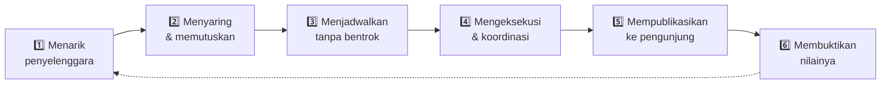

<div align="center">

# Analisis Mendalam

### Mengapa Sistem Ini Kuat untuk Manajemen Event

<sub>Analisis berbasis pembacaan kode, bukan daftar fitur pemasaran · 18 Agustus 2026</sub>

</div>

---

## Kerangka Analisis

Daftar fitur tidak menjawab pertanyaan "kenapa bagus". Yang menjawab adalah: **pekerjaan apa yang harus dilakukan tim event setiap hari, dan bagaimana sistem ini mengubah beban pekerjaan itu.**

Manajemen event mall punya enam pekerjaan inti yang berulang sepanjang tahun:

<div align="center">



</div>

Sistem ini menyentuh **keenam fase**. Itulah perbedaan mendasarnya: sebagian besar tools hanya menyentuh satu atau dua fase, sehingga tim tetap harus menambal sisanya dengan spreadsheet dan WhatsApp.

Analisis di bawah menelusuri fase demi fase, dengan bukti dari kode.

---

## Fase 1 · Menarik Penyelenggara

### Masalahnya

Lead masuk lewat DM Instagram, WhatsApp pribadi staf, atau obrolan lisan. Tidak ada catatan, tidak ada standar informasi, tidak ada cara tahu berapa banyak pengajuan bulan ini.

### Yang dilakukan sistem

**Community Hub bukan sekadar formulir — ia corong konversi.** Urutan halamannya dirancang menjawab keberatan sebelum meminta komitmen: value proposition → benefit → fasilitas → cara daftar → bukti (galeri + event nyata) → baru form → FAQ.

Prinsip yang tertulis eksplisit di `PRODUCT.md`: **"Proof before form"** — tunjukkan event nyata, galeri, dan statistik sebelum meminta orang mengisi apa pun.

### Mekanisme yang paling berdampak: form adaptif

<table>
<tr><td width="50%" valign="top">

**Delapan jenis organisasi** dikenali sistem:
`community` · `school` · `company` · `eo` · `campus` · `government` · `ngo` · `other`

Komponen `OrganizationTypeSelector` + `TypeSpecificFields` menampilkan **field berbeda sesuai jenis** yang dipilih.

</td><td width="50%" valign="top">

**Kenapa ini penting secara operasional:**

Sekolah dan perusahaan butuh informasi yang berbeda. Satu form generik memaksa staf menelepon balik untuk melengkapi data — atau lebih buruk, memutuskan tanpa informasi cukup.

Form adaptif memindahkan beban pengumpulan data dari **staf** ke **pendaftar**, tepat pada saat motivasi pendaftar sedang paling tinggi.

</td></tr>
</table>

### Nilai bagi manajemen event

| Sebelum | Sesudah |
|---|---|
| Lead tersebar di banyak inbox pribadi | Satu inbox terstruktur dengan status `pending → reviewed → approved/rejected` |
| Data tidak seragam, sering tidak lengkap | Field wajib divalidasi dua sisi (Zod di client + server) |
| Tidak bisa dihitung | Kartu "Pendaftaran" di Pusat Komando menampilkan jumlah yang menunggu review |

---

## Fase 2 · Menyaring & Memutuskan

Ini fase yang **paling sering diabaikan** tools lain, dan justru paling menentukan kualitas kalender.

### Keputusan desain yang berani: approve ≠ langsung masuk jadwal

Sebagian besar sistem akan menganggap "approve pendaftaran" otomatis membuat entri jadwal. Sistem ini **menolak melakukannya** ([ADR 003](docs/adr/003-registration-not-auto-draft.md)). Approve hanya berarti "lead ini layak dilanjutkan". Untuk masuk antrian, staf harus menekan CTA **"Buat Draft dari pendaftaran"** secara sadar.

> **Analisis:** ini terlihat seperti langkah ekstra yang tidak efisien. Sebenarnya sebaliknya. Antara "layak dipertimbangkan" dan "sudah pasti dijadwalkan" ada jarak negosiasi yang panjang — tanggal, lokasi, kebutuhan teknis, kesiapan penyelenggara. Sistem yang otomatis membuat jadwal dari approval akan mengisi kalender dengan event yang belum tentu terjadi, lalu kalender kehilangan kredibilitas dan tim berhenti mempercayainya. **Kalender yang tidak dipercaya tidak akan dipakai.**

### Antrian Draft: ruang berpikir yang aman

Draft adalah entitas terpisah dengan siklus keputusannya sendiri:

<div align="center">

| Progress | Arti operasional |
|:--:|---|
| `draft` | Masih dibahas, tanggal bisa berubah |
| `confirm` | Sudah disepakati, siap diumumkan |
| `cancel` | Tidak jadi — tetap tersimpan sebagai catatan |

</div>

### Gerbang publikasi yang dijaga dua lapis

```ts
// src/utils/draftUtils.ts
export function canPublishDraft(draft): boolean {
  if (draft.published) return false;   // tidak bisa publish dua kali
  if (draft.deleted)   return false;   // yang dibuang tidak bisa naik
  if (draft.progress !== 'confirm') return false;  // wajib dikonfirmasi dulu
  return true;
}
```

Komentar di atas fungsi ini berbunyi: *"Must match api/supabase-admin.js publishDraft guards."* — **aturan yang sama ditegakkan ulang di server.** Kalau seseorang memanipulasi request dari browser, server tetap menolak.

> **Analisis:** ini yang membedakan sistem produksi dari prototipe. Validasi di UI hanya ramah pengguna; validasi di server yang benar-benar melindungi data. Bagi manajemen event artinya: **tidak ada event setengah matang yang bisa bocor ke publik**, bahkan karena kesalahan teknis.

---

## Fase 3 · Menjadwalkan Tanpa Bentrok

### Bentuk waktu yang sesuai kenyataan mall

Event mall jarang berbentuk "satu hari, satu jam". Sistem mengenali tiga bentuk:

<table>
<tr><th align="left" width="18%">Bentuk</th><th align="left">Realita yang diwakili</th></tr>
<tr><td><code>single</code></td><td>Satu hari — pentas, talkshow, donor darah</td></tr>
<tr><td><code>multi_day</code></td><td>Bazaar 10 hari dengan <b>jam berbeda tiap hari</b> (<code>dayTimeSlots</code>) — weekday tutup lebih awal, weekend lebih panjang</td></tr>
<tr><td><code>recurring</code></td><td>Series berbagi <code>recurrenceGroupId</code>; bisa dihapus sekaligus satu series (<code>deleteRecurringSeries</code>)</td></tr>
</table>

> Detail `dayTimeSlots` jarang ditemukan bahkan di produk komersial. Ini muncul dari pemahaman lapangan: bazaar yang berjalan dua minggu **tidak** punya jam operasional seragam. Tanpa field ini, staf akan menuliskannya di kolom keterangan — dan informasi itu tidak akan pernah bisa dipakai sistem untuk apa pun.

### Status yang menghitung dirinya sendiri

Fungsi `getStatus()` di `eventUtils.ts` bukan pembanding tanggal sederhana. Ia menangani:

1. **Multi-day** — cek apakah hari ini di antara `dateStr` dan `dateEnd`
2. **Jam berakhir di hari terakhir** — mengambil `dayTimeSlots` hari itu; bazaar yang tutup pukul 21:00 berstatus `past` pukul 21:01, bukan menunggu ganti hari
3. **Rentang jam di hari yang sama** — event pukul 10:00–12:00 tidak lagi "berlangsung" pada pukul 15:00

```
Multi-day → hari ini > dateEnd?           → past
          → hari ini < dateStr?           → upcoming
          → hari terakhir & lewat jam?    → past
          → selain itu                    → ongoing
```

> **Analisis nilai kerja:** dengan 30 event aktif, memperbarui status manual berarti ±30 keputusan kecil per hari yang tidak menghasilkan nilai apa pun — dan satu kali lupa membuat halaman publik menampilkan informasi salah. Sistem ini menghapus seluruh kategori pekerjaan itu. Kolom `status` di database tetap ada, tapi hanya sebagai **cache**; kebenaran selalu dihitung ulang saat baca/tulis ([ADR 002](docs/adr/002-event-status-from-dates.md)).

### Konteks perencanaan: tema tahunan dan hari libur

Dua tabel pendamping ikut ditarik bersama event (`fetchEvents` mengembalikan `events`, `themes`, `holidays`):

- **Tema Tahunan** — payung periode kampanye mall, tampil di quarter timeline. Membantu menjawab "kuartal ini temanya apa, dan apakah event ini nyambung?"
- **Libur nasional & cuti bersama** — muncul di kalender. Bagi mall, tanggal merah adalah **puncak trafik**, bukan hari kosong. Menjadwalkan tanpa melihatnya sama dengan membuang slot paling berharga.

---

## Fase 4 · Eksekusi & Koordinasi

### Empat cara melihat data yang sama

Ini bukan variasi kosmetik. Tiap tampilan menjawab pertanyaan berbeda:

<table>
<tr><th align="left" width="16%">Tampilan</th><th align="left" width="42%">Menjawab pertanyaan</th><th align="left">Dipakai saat</th></tr>
<tr><td><b>Tabel</b></td><td>"Mana event yang PIC-nya belum diisi?"</td><td>Kerja detail, audit kelengkapan data</td></tr>
<tr><td><b>Kalender</b></td><td>"Tanggal 17 sudah ada apa saja?"</td><td>Menentukan tanggal untuk pengajuan baru</td></tr>
<tr><td><b>Kanban</b></td><td>"Apa yang sedang jalan hari ini?"</td><td>Briefing harian tim</td></tr>
<tr><td><b>Timeline</b></td><td>"Kuartal depan padat atau kosong?"</td><td>Rapat perencanaan, laporan ke manajemen</td></tr>
</table>

Kolom Kanban **Internal** hanya muncul jika dua syarat terpenuhi sekaligus: pengguna punya izin `canEditEvents`, **dan** memang ada baris berstatus draft. Tidak ada kolom kosong yang membingungkan bagi yang tidak berkepentingan.

### Percepatan input yang sering terlewat: saran dari riwayat

```ts
// src/utils/draftUtils.ts — getDraftSuggestions()
// Mengumpulkan nilai unik dari draft terdahulu, diurutkan
// berdasarkan FREKUENSI PEMAKAIAN, bukan abjad.
```

Saat staf mengisi nama EO, lokasi, atau PIC, sistem menyarankan nilai yang paling sering dipakai sebelumnya.

> **Analisis:** manfaatnya dobel. Pertama, kecepatan mengetik. Kedua — dan ini lebih penting — **konsistensi data**. Tanpa saran, "Atrium Utama", "atrium utama", dan "Atrium 1" menjadi tiga nilai berbeda di database, dan filter atau statistik apa pun langsung rusak. Pengurutan berdasarkan frekuensi berarti nilai yang benar secara organisasi otomatis muncul paling atas.

### Menjembatani ke realita komunikasi Indonesia

```ts
export function normalizePhoneToWhatsApp(phone: string) {
  const digits = String(phone || '').replace(/\D/g, '');
  if (digits.startsWith('62')) return digits;
  if (digits.startsWith('0'))  return `62${digits.slice(1)}`;
  return digits;
}
```

Nomor `0812...`, `62812...`, `+62 812-...`, atau `0812-3456-7890` semuanya dinormalkan menjadi satu link `wa.me` yang bisa langsung diklik.

> **Analisis:** koordinasi event di Indonesia terjadi di WhatsApp — itu fakta, bukan preferensi. Sistem yang mengabaikannya memaksa staf menyalin nomor, membersihkan format, lalu mencari kontaknya. Detail kecil ini menghemat langkah pada aksi yang dilakukan **puluhan kali sehari**. Kualitas sebuah tool operasional ditentukan oleh detail semacam ini, bukan oleh jumlah fiturnya.

### Surat resmi: dari data yang sudah ada

`LetterGenerator` mengisi otomatis dari Event **maupun** Draft — artinya surat bisa dibuat **sebelum** event resmi terjadwal, yang memang urutan nyatanya (surat sering menjadi syarat konfirmasi).

Field yang dihasilkan: nomor surat, tanggal surat, nama EO, penanggung jawab, alamat, nama acara, lokasi, hari/tanggal, waktu, telepon. Hasilnya tersimpan sebagai `GeneratedLetter` di database dan punya halaman publik `/letter/:id` untuk dibagikan.

> Sebelumnya jalur ini memakai Google Apps Script/AutoCrat. [ADR 004](docs/adr/004-letter-supabase-kill-gas.md) menghentikannya: satu jalur data, bisa diaudit, tanpa ketergantungan Sheets.

### Bekerja berbarengan tanpa saling menimpa

```ts
supabase.channel('events-realtime')
  .on('postgres_changes', { table: 'events' },        scheduleRefresh)
  .on('postgres_changes', { table: 'annual_themes' }, scheduleRefresh)
  .on('postgres_changes', { table: 'holidays' },      scheduleRefresh)
```

Perubahan disiarkan ke semua sesi yang terbuka, dengan debounce 400ms agar burst perubahan tidak memicu badai refresh.

> **Analisis:** tim event jarang bekerja sendirian. Tanpa realtime, dua staf bisa membuat entri untuk slot yang sama karena keduanya melihat data lama. Ini bukan fitur kenyamanan — ini **pencegahan konflik data**.

---

## Fase 5 · Mempublikasikan

### Satu sumber data, banyak permukaan

Yang membuat ini berbeda dari sekadar "punya website": halaman publik **membaca database yang sama** dengan dashboard. Publish sekali, tampil di semua tempat. Tidak ada langkah "salin ke website".

Permukaan publiknya: Community Hub (`/`) · Jadwal (`/events`) · Galeri (`/gallery`) · Detail album · Viewer surat · Halaman survey.

### Pertahanan berlapis agar data internal tidak bocor

Ini pola yang konsisten di seluruh kode — sesuatu yang jarang dilakukan dengan disiplin:

<table>
<tr><th align="left" width="34%">Lapisan</th><th align="left">Penjagaan</th></tr>
<tr><td>Query aplikasi</td><td><code>publicEvents = events.filter(e => e.status !== 'draft')</code></td></tr>
<tr><td>Tampilan dashboard</td><td><code>visibleEvents</code> menyaring ulang berdasarkan <code>canSeeInternalSchedule</code></td></tr>
<tr><td>Entitas terpisah</td><td>Draft tidak berada di tabel Event sama sekali</td></tr>
<tr><td><b>Ekspor PDF</b></td><td><code>filterScheduleEventsForPdf()</code> menyaring lagi sebelum render</td></tr>
<tr><td>Database</td><td>Kebijakan RLS Supabase</td></tr>
</table>

> **Analisis:** perhatikan lapisan PDF. Banyak sistem menjaga tampilan layar dengan ketat lalu lupa bahwa **ekspor adalah kebocoran paling berbahaya** — file PDF beredar di grup WhatsApp, dikirim ke penyelenggara luar, dan tidak bisa ditarik kembali. Ada test unit khusus yang menjaga filter ini tetap ada.

---

## Fase 6 · Membuktikan Nilai — Bagian Terkuat Sistem Ini

Sebagian besar sistem event berhenti setelah event selesai. Di sinilah sistem ini justru paling menonjol, dan **inilah alasan terkuat mengapa manajemen event membutuhkannya.**

### Dua instrumen feedback yang sengaja dipisah

<table>
<tr><th align="left" width="26%"></th><th align="left" width="37%">Survey Kepuasan</th><th align="left" width="37%">Evaluasi Tenant</th></tr>
<tr><td><b>Responden</b></td><td>Pengunjung / organizer</td><td>Tenant & gerai di mall</td></tr>
<tr><td><b>Skala</b></td><td>1–10</td><td>1–5 + pilihan kategorikal</td></tr>
<tr><td><b>Pertanyaan inti</b></td><td>"Bagaimana pengalamannya?"</td><td>"Apakah event ini menguntungkan Anda?"</td></tr>
</table>

`CONTEXT.md` bahkan melarang penggunaan kata "Survey" generik tanpa kualifikasi — karena mencampur keduanya akan menghasilkan analitik yang menyesatkan.

### Survey Kepuasan menilai dua pihak sekaligus

Struktur `SurveyResponse` mengungkap sesuatu yang cerdas — ada **dua kelompok penilaian terpisah**:

<table>
<tr><td width="50%" valign="top">

**Menilai mall** (`mall_*`)
- Kebersihan
- Pelayanan staf
- Koordinasi
- Keamanan

</td><td width="50%" valign="top">

**Menilai penyelenggara** (`eo_*`)
- Kualitas event
- Organisasi
- Pelayanan panitia
- Akurasi promosi
- Rekomendasi

</td></tr>
</table>

> **Analisis:** ini menjawab dua pertanyaan manajerial yang berbeda dari satu kali pengambilan data. Skor `mall_*` mengarah pada perbaikan internal. Skor `eo_*` membangun **rekam jejak penyelenggara** — dasar berbasis bukti untuk memutuskan siapa yang layak diundang kembali tahun depan, dan siapa yang tidak. Tanpa data ini, keputusan tersebut dibuat berdasarkan ingatan dan kedekatan personal.

### Evaluasi Tenant mengukur dampak bisnis nyata

Inilah temuan paling penting dari seluruh analisis. Sistem tidak hanya menanyakan kepuasan — ia menanyakan **dampak ekonomi**:

<div align="center">

| Yang diukur | Pilihan jawaban |
|---|---|
| **Kenaikan trafik** | Signifikan · Sedikit Naik · Tidak Ada · Menurun |
| **Kenaikan penjualan** | Tidak ada · < 10% · 10–30% · 30–50% · > 50% |
| **Zona lokasi** | Atrium Utama · Pintu Utara 2 · Lantai Dasar · Lantai 1 · 2 · 3 |
| **Kategori usaha** | F&B · Fashion · Lifestyle · Hiburan Anak · Jasa · Supermarket |

</div>

Fungsi `aggregateResults()` mengolahnya menjadi:

- **Distribusi** trafik, penjualan, kategori, dan zona
- **Peringkat 10 gerai teratas** berdasarkan skor sinyal positif (`trafficPos + salesPos`)
- **Tabulasi silang kategori × kenaikan penjualan**
- **Tren bulanan** dan rata-rata rating per event

Semuanya bisa **diekspor ke PDF**.

> ### Mengapa ini mengubah posisi tim event
>
> Tim event mall biasanya diperlakukan sebagai **pusat biaya** — mereka menghabiskan anggaran untuk keramaian yang sulit dibuktikan nilainya. Ketika manajemen bertanya "apa hasilnya?", jawaban yang tersedia biasanya foto keramaian dan perkiraan jumlah pengunjung.
>
> Dengan data ini, jawabannya berubah bentuk:
>
> *"Event ini diikuti 34 tenant. 71% melaporkan kenaikan trafik signifikan, 40% melaporkan kenaikan penjualan di atas 30%. Dampak terbesar di zona Atrium Utama pada kategori F&B. Berikut PDF-nya."*
>
> Itu bukan laporan kegiatan — itu **argumen anggaran**. Sistem ini memberi tim event bahasa yang dimengerti manajemen: angka, tren, dan bukti yang bisa diverifikasi. Menurut saya inilah alasan tunggal terkuat mengapa sistem ini layak dipakai.

### Menjaga kebersihan data survey

Karena responden tidak login, data mudah tercemar pengiriman ganda. Pertahanannya berlapis:

1. **Device fingerprint** — canvas + layar + zona waktu + bahasa + platform, di-hash djb2, disimpan di localStorage
2. **Pre-check** sebelum submit — memberi pesan ramah, bukan error
3. **Unique index database** — pengaman terakhir; kode menangkap error `23505` secara khusus

> Tanpa ini, satu orang antusias bisa mengisi 20 kali dan seluruh analitik menjadi tidak berarti. Detail seperti menangani kode error Postgres `23505` secara spesifik menunjukkan sistem ini **pernah dipakai sungguhan**, bukan hanya dirancang di atas kertas.

---

## Lima Alasan Struktural (Bukan Fitur)

Di luar fase operasional, ada lima sifat sistem yang menentukan apakah ia akan bertahan dipakai.

<table>
<tr><td width="5%" valign="top"><b>1</b></td><td valign="top">

**Bisa didelegasikan dengan aman.** Lima peran dengan matriks izin yang diuji unit test. Anak magang bisa diberi akun `viewer` untuk menarik laporan tanpa risiko menghapus event. Tenant Relation melihat analitik tanpa akses operasional. Tanpa lapisan ini, semua orang butuh akun admin — dan sistem menjadi rapuh.

</td></tr>
<tr><td valign="top"><b>2</b></td><td valign="top">

**Setiap perubahan tercatat.** Log aktivitas bisa difilter per jenis aksi, jenis sumber daya, dan rentang tanggal. Ketika muncul pertanyaan "siapa yang mengubah tanggal event ini?", ada jawabannya. Ini mengubah dinamika tim: dari saling menuduh menjadi memeriksa catatan.

</td></tr>
<tr><td valign="top"><b>3</b></td><td valign="top">

**Pusat Komando menyorot yang butuh perhatian.** Kartu dengan penanda `attention` menyala otomatis: ada event berlangsung, ada draft menunggu, ada pendaftaran belum direview. Dashboard yang hanya menampilkan angka membuat pengguna harus menafsirkan sendiri; dashboard yang menunjukkan **apa yang harus dikerjakan hari ini** akan benar-benar dibuka setiap pagi.

</td></tr>
<tr><td valign="top"><b>4</b></td><td valign="top">

**Dibuat untuk ponsel.** Tim event bekerja sambil berjalan di area mall, bukan duduk di meja. Mobile-first di sini keputusan operasional, bukan tren desain.

</td></tr>
<tr><td valign="top"><b>5</b></td><td valign="top">

**Kosakatanya dikunci.** `CONTEXT.md` menetapkan arti kanonik tiap istilah beserta apa yang **bukan** artinya, dengan aturan tegas: *"kalau kode dan glossary bentrok, glossary menang."* Efek praktisnya, tim bisnis dan tim teknis memakai kata yang sama — "Draft" tidak pernah berarti dua hal berbeda di dua ruang rapat.

</td></tr>
</table>

---

## Risiko Operasional yang Dihilangkan

Cara lain menilai sebuah sistem: kegagalan apa yang menjadi **tidak mungkin terjadi**, bukan sekadar lebih jarang.

| Mode kegagalan | Sebelumnya | Penjagaan sekarang |
|---|---|---|
| Event internal bocor ke publik | Sangat mungkin | 5 lapis filter + entitas terpisah + test |
| Status jadwal basi | Hampir pasti terjadi | Dihitung dari tanggal + jam, tidak bisa basi |
| Draft belum siap ikut terbit | Mungkin | Gerbang `progress === 'confirm'`, ditegakkan client **dan** server |
| Nama lokasi/EO tidak konsisten | Sangat mungkin | Saran otomatis berbasis frekuensi |
| Survey diisi berulang | Mungkin | Fingerprint + unique index DB |
| Dua staf menimpa pekerjaan | Mungkin | Sinkronisasi realtime |
| PDF jadwal memuat data internal | Mungkin | Filter khusus di jalur ekspor + test |
| Tidak tahu siapa mengubah apa | Pasti | Log aktivitas |

---

## Batas Jujur: Yang Belum Ada

Analisis yang kredibel harus menyebut yang tidak ada. Berikut hasil pemeriksaan kode — semuanya **peluang pengembangan**, bukan cacat.

<table>
<tr><th align="left" width="30%">Belum tersedia</th><th align="left" width="40%">Dampak operasional</th><th align="left" width="30%">Catatan</th></tr>

<tr><td valign="top"><b>Deteksi bentrok slot otomatis</b></td>
<td valign="top">Sistem tidak memperingatkan bila dua event dijadwalkan di lokasi dan waktu yang sama. Tampilan Kalender membantu secara visual, tapi keputusannya tetap manual.</td>
<td valign="top">Peluang paling bernilai berikutnya. Data yang diperlukan (<code>lokasi</code>, <code>dateStr</code>, <code>dateEnd</code>, <code>jam</code>) sudah lengkap tersimpan — tinggal logikanya.</td></tr>

<tr><td valign="top"><b>Notifikasi & pengingat</b></td>
<td valign="top">Tidak ada email/WhatsApp otomatis untuk "event H-3" atau "pendaftaran baru masuk". Tim harus membuka dashboard.</td>
<td valign="top">Pusat Komando sudah menyorot yang perlu perhatian, tapi bersifat <i>pull</i>, bukan <i>push</i>.</td></tr>

<tr><td valign="top"><b>Anggaran & biaya</b></td>
<td valign="top">Ada <code>eventModel</code> (free/bayar/support) dan <code>eventNominal</code>, tapi bukan pelacakan biaya sungguhan.</td>
<td valign="top">Disengaja — ranah keuangan biasanya dipegang sistem terpisah.</td></tr>

<tr><td valign="top"><b>Checklist tugas & vendor</b></td>
<td valign="top">Persiapan teknis per event (sound, listrik, perizinan) tidak dilacak.</td>
<td valign="top">Perluasan alami dari entitas Event.</td></tr>

<tr><td valign="top"><b>Hitung kehadiran</b></td>
<td valign="top">Tidak ada perkiraan atau pencatatan jumlah pengunjung per event.</td>
<td valign="top">Sebagian tergantikan oleh sinyal trafik dari Evaluasi Tenant.</td></tr>
</table>

> Yang perlu diperhatikan: **tidak satu pun dari kekurangan ini menyentuh fondasi.** Semuanya adalah penambahan di atas model domain yang sudah benar. Itu situasi yang jauh lebih baik daripada sistem berfitur lengkap dengan fondasi yang keliru — karena fitur mudah ditambah, sedangkan model domain yang salah harus dibongkar.

---

## Kesimpulan

<div align="center">

### Tiga alasan inti

</div>

<table>
<tr><td width="6%" valign="top"><b>1</b></td><td valign="top">

**Ia menutup seluruh siklus, bukan sepotong.** Dari komunitas yang belum mengenal mall, sampai bukti kenaikan penjualan tenant setelah event usai. Tidak ada jurang antar fase yang harus ditambal spreadsheet atau WhatsApp — dan jurang antar-tool itulah tempat pekerjaan operasional biasanya hilang.

</td></tr>
<tr><td valign="top"><b>2</b></td><td valign="top">

**Ia menghapus kategori pekerjaan, bukan sekadar mempercepatnya.** Memperbarui status, menyalin jadwal ke website, membersihkan format nomor telepon, mengetik ulang data event ke surat — semuanya hilang, bukan menjadi lebih cepat. Waktu yang dibebaskan berpindah ke pekerjaan yang benar-benar bernilai: kurasi dan hubungan dengan penyelenggara.

</td></tr>
<tr><td valign="top"><b>3</b></td><td valign="top">

**Ia mengubah tim event dari pusat biaya menjadi pemilik data.** Evaluasi Tenant dengan metrik kenaikan trafik dan penjualan memberi tim bukti kuantitatif atas dampak pekerjaan mereka. Ini satu-satunya fitur yang mengubah **posisi tawar tim di dalam organisasi**, bukan sekadar kenyamanan kerjanya.

</td></tr>
</table>

<div align="center">

<sub>Dokumen terkait: <a href="./PRESENTASI.md">PRESENTASI.md</a> · <a href="./RISET-PEMBANDING.md">RISET-PEMBANDING.md</a> · <a href="./CONTEXT.md">CONTEXT.md</a> · <a href="./docs/SPEC.md">docs/SPEC.md</a></sub>

</div>
