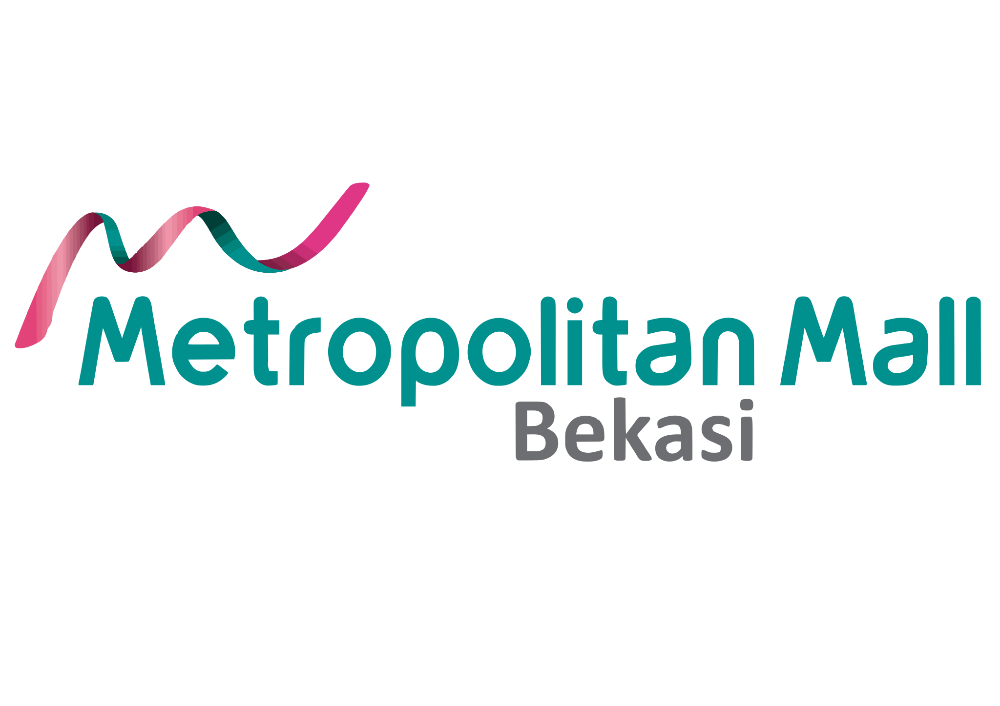

# Dashboard Calendar Event

### Ringkasan untuk Manajemen

Urutan penyajian: hasil → risiko → biaya → mekanisme → keputusan

---

## 1 · Intinya dalam Satu Halaman

<table>
<tr><td width="50%" valign="top">

### Apa ini

Sistem operasional event Metropolitan Mall Bekasi yang menutup satu siklus penuh: dari komunitas yang mengajukan diri, penjadwalan internal, publikasi ke pengunjung, sampai **bukti dampak event terhadap penjualan tenant**.

Sudah berjalan di produksi, bukan konsep.

</td><td width="50%" valign="top">

### Kenapa perlu diperhatikan

Yang biasanya tidak dimiliki tim event adalah **bukti kuantitatif atas dampak pekerjaannya**. Sistem ini menghasilkannya secara otomatis dari event yang berjalan.

Dampaknya bukan sekadar kerja lebih rapi — melainkan posisi tim event dalam pembahasan anggaran.

</td></tr>
</table>

| Yang dihasilkan | Bentuk konkretnya |
|---|---|
| 📈 **Bukti dampak event** | Laporan PDF: % tenant yang penjualannya naik, per zona, per kategori |
| 🎯 **Rekam jejak penyelenggara** | Skor tiap EO dari responden — dasar keputusan mengundang kembali |
| 🛡️ **Pengurangan risiko** | 8 mode kegagalan operasional yang dihilangkan secara sistemik |
| ⏱️ **Pembebasan waktu staf** | Beberapa kategori pekerjaan manual hilang, bukan sekadar dipercepat |
| 🌐 **Wajah publik yang hidup** | Jadwal, galeri, dan corong pendaftaran komunitas yang selalu sinkron |

---

## 2 · Hasil yang Paling Bernilai: Bukti Dampak Event

> Ini bagian yang sebaiknya dibaca lebih dulu. Sisanya adalah penjelasan bagaimana hasil ini dimungkinkan.

### Masalah klasik tim event

Ketika manajemen bertanya *"event kemarin hasilnya apa?"*, jawaban yang tersedia biasanya foto keramaian dan perkiraan jumlah pengunjung. Tidak ada yang bisa diverifikasi, tidak ada yang bisa dibandingkan antar event, dan tidak ada yang bisa dijadikan dasar keputusan anggaran.

Akibatnya tim event terus diposisikan sebagai **pusat biaya**.

### Yang dilakukan sistem ini

Setiap event dapat diikuti **Evaluasi Tenant** — tenant dan gerai mengisi dampak yang mereka rasakan:

| Yang ditanyakan | Pilihan jawaban |
|---|---|
| **Kenaikan trafik pengunjung** | Signifikan · Sedikit Naik · Tidak Ada · Menurun |
| **Kenaikan penjualan** | Tidak ada · < 10% · 10–30% · 30–50% · > 50% |
| **Zona lokasi gerai** | Atrium Utama · Pintu Utara 2 · Lantai Dasar · Lantai 1 · 2 · 3 |
| **Kategori usaha** | F&B · Fashion · Lifestyle · Hiburan Anak · Jasa · Supermarket |

Sistem mengolahnya otomatis menjadi distribusi dampak, **peringkat gerai paling terdampak**, tabulasi silang kategori × kenaikan penjualan, tren bulanan, dan **laporan PDF siap presentasi**.

### Perubahan bentuk jawaban

<table>
<tr>
<td width="50%" valign="top">

**❌ Sebelumnya**

> "Event-nya ramai, banyak yang datang. Tenant kelihatannya senang. Ini foto-fotonya."

Tidak bisa diverifikasi · tidak bisa dibandingkan · tidak bisa dijadikan dasar keputusan

</td>
<td width="50%" valign="top">

**✅ Sekarang**

> "34 tenant mengisi evaluasi. 71% melaporkan kenaikan trafik signifikan, 40% melaporkan penjualan naik di atas 30%. Dampak terbesar di Atrium Utama pada kategori F&B. Laporan lengkapnya terlampir."

Terverifikasi · bisa dibandingkan antar event · **argumen anggaran**

</td>
</tr>
</table>

### Manfaat turunan yang sama pentingnya

<table>
<tr><td width="4%" valign="top"><b>a</b></td><td valign="top"><b>Keputusan alokasi zona berbasis data.</b> Jika kategori F&B di Atrium Utama konsisten menunjukkan dampak tertinggi, penempatan event berikutnya punya dasar — bukan kebiasaan.</td></tr>
<tr><td valign="top"><b>b</b></td><td valign="top"><b>Rekam jejak penyelenggara.</b> Survey Kepuasan menilai <b>dua pihak sekaligus</b>: kinerja mall (kebersihan, pelayanan, koordinasi, keamanan) <i>dan</i> kinerja penyelenggara (kualitas event, organisasi, akurasi promosi). Keputusan mengundang kembali jadi berbasis skor, bukan ingatan atau kedekatan personal.</td></tr>
<tr><td valign="top"><b>c</b></td><td valign="top"><b>Bahan negosiasi dengan tenant.</b> Data bahwa event menaikkan trafik gerai adalah alat persuasi saat membahas partisipasi atau perpanjangan sewa.</td></tr>
</table>

---

## 3 · Risiko Operasional yang Dihilangkan

Nilai kedua sebuah sistem: kegagalan apa yang menjadi **tidak mungkin terjadi** — bukan sekadar lebih jarang.

| Risiko | Dampak bila terjadi | Status di sistem ini |
|---|---|---|
| Jadwal internal yang belum pasti bocor ke publik | Kredibilitas mall di mata komunitas & tenant | ✅ Dicegah 5 lapis, termasuk di jalur ekspor PDF |
| Informasi jadwal publik basi/salah | Pengunjung datang untuk event yang sudah lewat | ✅ Status dihitung otomatis dari tanggal & jam |
| Event belum dikonfirmasi ikut terbit | Pembatalan publik, kerugian reputasi | ✅ Gerbang konfirmasi, ditegakkan di server |
| Data lokasi/penyelenggara tidak konsisten | Laporan dan statistik tidak bisa dipercaya | ✅ Saran otomatis berbasis riwayat pemakaian |
| Hasil survey tercemar pengisian berulang | Keputusan diambil dari data palsu | ✅ Fingerprint perangkat + kunci unik database |
| Dua staf saling menimpa pekerjaan | Data hilang, slot ganda | ✅ Sinkronisasi realtime antar pengguna |
| Tidak diketahui siapa mengubah apa | Tidak ada akuntabilitas | ✅ Log aktivitas dengan filter & rentang tanggal |
| Staf baru merusak data karena akses berlebih | Kehilangan data operasional | ✅ 5 tingkat peran dengan izin terpisah |

> **Catatan tata kelola:** akses bertingkat berarti pekerjaan bisa didelegasikan dengan aman. Staf magang dapat diberi akun baca-saja untuk menarik laporan tanpa kemampuan menghapus event. Tanpa lapisan ini, semua orang membutuhkan akses penuh — dan itu titik rapuh yang umum di sistem operasional.

---

## 4 · Pembebasan Waktu Staf

Yang dihapus bukan sekadar dipercepat — **hilang sama sekali** sebagai kategori pekerjaan.

<table>
<tr><th align="left" width="42%">Pekerjaan manual sebelumnya</th><th align="left" width="58%">Sekarang</th></tr>
<tr><td>Memperbarui status tiap event (berlangsung/selesai)</td><td>Dihitung otomatis dari tanggal + jam — termasuk jam tutup di hari terakhir bazaar</td></tr>
<tr><td>Menyalin jadwal ke website / poster informasi</td><td>Halaman publik membaca data yang sama; publish sekali, tampil di semua tempat</td></tr>
<tr><td>Mengetik ulang data event ke dalam surat resmi</td><td>Surat terisi otomatis dari data event atau draft, hasilnya PDF</td></tr>
<tr><td>Merapikan format nomor telepon untuk menghubungi PIC</td><td>Tombol WhatsApp langsung; semua format nomor dinormalkan otomatis</td></tr>
<tr><td>Merekap jadwal untuk rapat/laporan</td><td>Unduh jadwal sebagai PDF</td></tr>
<tr><td>Menagih data yang kurang dari pendaftar</td><td>Form adaptif per jenis organisasi meminta data yang tepat sejak awal</td></tr>
<tr><td>Merekap hasil survey secara manual</td><td>Agregasi, tren, dan peringkat dihitung sistem; ekspor PDF</td></tr>
</table>

**Waktu yang dibebaskan berpindah ke pekerjaan yang tidak bisa diotomasi:** kurasi konsep event dan hubungan dengan penyelenggara.

---

## 5 · Posisi Dibanding Mall Lain

Riset lapangan terhadap mall Indonesia, mall Amerika dengan program komunitas, dan platform open-source. Detail: [`RISET-PEMBANDING.md`](./RISET-PEMBANDING.md).

<table>
<tr><th align="left" width="30%">Pembanding</th><th align="left">Kondisi mereka</th></tr>
<tr><td><b>Pakuwon Mall</b> pembanding terbaik di Indonesia</td><td>Katalog event dengan filter <i>Now / Coming Soon / Previous</i> — tapi diisi manual, tanpa jalur pendaftaran komunitas, tanpa sisi operasional</td></tr>
<tr><td><b>Summarecon Mall Bekasi</b> kompetitor satu kota</td><td>Daftar event satu arah; komunitas tidak punya cara mengajukan diri</td></tr>
<tr><td><b>Mall of America</b> mall terkenal sedunia</td><td>Event komunitas dikelola lewat <b>handbook PDF + Microsoft Forms + dokumen fisik</b> dua bulan sebelum acara; program penampilan grup satuan akhirnya ditutup karena volume permintaan</td></tr>
<tr><td><b>Holyoke Mall</b> AS, program ruang gratis nonprofit</td><td>Proposisi nilai hampir identik dengan Community Hub kita — tapi pendaftarannya unduh PDF, isi manual, unggah balik, tunggu email</td></tr>
<tr><td><b>Platform open-source</b> Eventyay, Attendize</td><td>Semuanya berpusat pada penjualan tiket ke peserta — bukan pada venue yang mengkurasi event pihak lain</td></tr>
</table>

**Lima kapabilitas tidak ditemukan pada satu pun pembanding:**

antrian pra-jadwal · status otomatis · generator surat resmi · unduh jadwal PDF · evaluasi dampak tenant

> **Yang paling perlu diketahui manajemen:** halaman event di situs resmi kita saat ini (`malmetropolitan.com/event`) hanya berisi kumpulan gambar promo tanpa tanggal, tanpa lokasi, dan tautannya kosong. Nama file di servernya harfiah `WhatsApp Image 2026-08-05....jpeg` — bukti langsung bahwa alur kerja hari ini masih berbasis chat manual.
>
> Sistem ini juga **bukan pendatang asing**: ia terhubung ke MID loyalty API di `apiloyalty.metropolitanland.com` — host yang sama dengan yang dipakai situs resmi untuk aset gambarnya.

---

## 6 · Bagaimana Hasil Itu Dimungkinkan

Bagian ini menjelaskan mekanismenya secara ringkas. Uraian teknis lengkap ada di [`ANALISIS-MANAJEMEN-EVENT.md`](./ANALISIS-MANAJEMEN-EVENT.md).

Sistem mengikuti siklus kerja tim event, dari belakang ke depan:

<table>
<tr><th align="left" width="8%">Fase</th><th align="left" width="30%">Yang terjadi</th><th align="left">Mekanisme kuncinya</th></tr>

<tr><td valign="top"><b>6️⃣</b></td><td valign="top"><b>Membuktikan nilai</b> bagian 2 di atas</td><td valign="top">Dua instrumen terpisah: Survey Kepuasan (pengunjung, skala 1–10, menilai mall <i>dan</i> penyelenggara) dan Evaluasi Tenant (dampak trafik & penjualan). Dipisah karena mencampurnya menghasilkan analitik menyesatkan.</td></tr>

<tr><td valign="top"><b>5️⃣</b></td><td valign="top"><b>Mempublikasikan</b></td><td valign="top">Halaman publik membaca database yang sama dengan dashboard — tidak ada langkah "salin ke website". Data internal dijaga 5 lapis agar tidak ikut terbit.</td></tr>

<tr><td valign="top"><b>4️⃣</b></td><td valign="top"><b>Eksekusi & koordinasi</b></td><td valign="top">Empat cara melihat data (tabel, kalender, kanban, timeline) untuk empat pertanyaan berbeda. Surat resmi terisi otomatis. Tombol WhatsApp ke PIC. Perubahan tersinkron realtime antar staf.</td></tr>

<tr><td valign="top"><b>3️⃣</b></td><td valign="top"><b>Penjadwalan</b></td><td valign="top">Mengenali event satu hari, multi-hari dengan <b>jam berbeda tiap hari</b>, dan event berulang. Kalender menampilkan tema tahunan serta libur nasional — hari puncak trafik mall.</td></tr>

<tr><td valign="top"><b>2️⃣</b></td><td valign="top"><b>Menyaring & memutuskan</b></td><td valign="top">Antrian Draft terpisah dari jadwal resmi, sehingga tim bisa merencanakan tanpa risiko bocor. Approve pendaftaran <b>sengaja tidak</b> otomatis membuat jadwal — mencegah kalender terisi event yang belum pasti.</td></tr>

<tr><td valign="top"><b>1️⃣</b></td><td valign="top"><b>Menarik penyelenggara</b></td><td valign="top">Community Hub sebagai corong konversi: bukti dulu (event nyata, galeri), form belakangan. Form menyesuaikan diri pada 8 jenis organisasi sehingga data masuk lengkap sejak awal.</td></tr>
</table>

---

## 7 · Batas Jujur & Pengembangan Berikutnya

Disampaikan terbuka agar ekspektasi tepat.

<table>
<tr><th align="left" width="34%">Belum tersedia</th><th align="left" width="38%">Konsekuensi</th><th align="left" width="28%">Prioritas usulan</th></tr>

<tr><td><b>Peringatan bentrok slot otomatis</b></td><td>Sistem belum memperingatkan bila dua event dijadwalkan di lokasi dan waktu sama; tampilan kalender membantu, tapi keputusan tetap manual</td><td>🔴 <b>Tertinggi</b> — data yang dibutuhkan sudah tersimpan lengkap</td></tr>

<tr><td><b>Notifikasi & pengingat otomatis</b></td><td>Tidak ada pemberitahuan "event H-3" atau "pendaftaran baru"; tim perlu membuka dashboard</td><td>🟠 Menengah</td></tr>

<tr><td><b>Checklist persiapan & vendor</b></td><td>Kesiapan teknis per event (sound, listrik, izin) belum dilacak sistem</td><td>🟠 Menengah</td></tr>

<tr><td><b>Pelacakan anggaran & biaya</b></td><td>Hanya ada skema kerja sama dan nominal, bukan akuntansi biaya</td><td>🟡 Rendah — umumnya ranah sistem keuangan terpisah</td></tr>

<tr><td><b>Penghitungan kehadiran</b></td><td>Jumlah pengunjung per event tidak dicatat</td><td>🟡 Rendah — sebagian tergantikan sinyal trafik dari tenant</td></tr>
</table>

> **Penilaian teknis:** tidak satu pun kekurangan di atas menyentuh fondasi sistem. Semuanya penambahan di atas struktur data yang sudah benar. Ini posisi yang jauh lebih baik daripada sistem berfitur lengkap dengan fondasi keliru — fitur mudah ditambahkan, model data yang salah harus dibongkar.

---

## 8 · Ringkasan Keputusan

### Tiga alasan sistem ini layak dilanjutkan

<table>
<tr><td width="6%" valign="top"><b>1</b></td><td valign="top"><b>Ia menghasilkan bukti, bukan sekadar kerapian.</b> Data dampak event terhadap trafik dan penjualan tenant memberi tim event bahasa yang dimengerti manajemen: angka yang bisa diverifikasi dan dibandingkan.</td></tr>

<tr><td valign="top"><b>2</b></td><td valign="top"><b>Ia menutup siklus penuh yang tidak dimiliki pembanding mana pun.</b> Dari komunitas yang belum mengenal mall sampai bukti kenaikan penjualan tenant — tanpa jurang antar tahap yang harus ditambal spreadsheet dan WhatsApp.</td></tr>

<tr><td valign="top"><b>3</b></td><td valign="top"><b>Ia menurunkan risiko operasional secara struktural.</b> Delapan mode kegagalan dicegah oleh desain sistem, bukan oleh kedisiplinan manusia yang harus dijaga terus-menerus.</td></tr>
</table>

### Usulan langkah berikutnya

| # | Langkah | Hasil yang diharapkan |
|:--:|---|---|
| 1 | Jalankan Evaluasi Tenant pada 2–3 event berikutnya | Laporan dampak pertama sebagai bahan rapat |
| 2 | Tetapkan pemilik akun per peran | Tata kelola akses jelas, delegasi aman |
| 3 | Kembangkan peringatan bentrok slot | Menutup celah operasional prioritas tertinggi |
| 4 | Arahkan pendaftaran komunitas ke Community Hub | Hentikan lead tercecer di DM pribadi |

---

Dokumen pendukung:
<a href="./ANALISIS-MANAJEMEN-EVENT.md">Analisis teknis mendalam</a> ·
<a href="./RISET-PEMBANDING.md">Riset pembanding lapangan</a> ·
<a href="./PRESENTASI.md">Deck presentasi lengkap</a>

