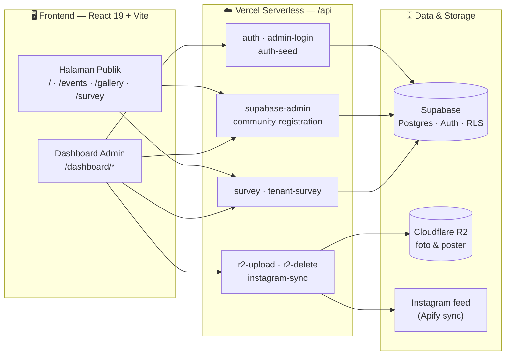
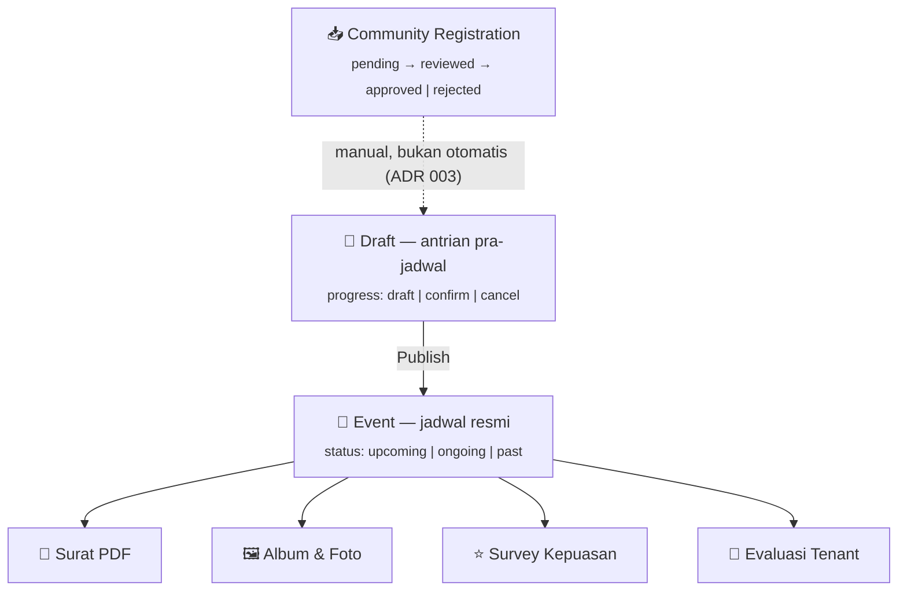

<div align="center">


# Dashboard Calendar Event

### Sistem Operasional Jadwal Event & Community Hub<br/>Metropolitan Mall Bekasi

<p>


</p>

<b>Live Demo:</b> <a href="https://metmal-community-hub.vercel.app/">metmal-community-hub.vercel.app</a> &nbsp;•&nbsp;
<b>Admin:</b> <a href="https://metmal-community-hub.vercel.app/dashboard">/dashboard</a>

</div>

---

## 1 · Ringkasan Eksekutif

<table>
<tr>
<td width="50%" valign="top">

### 🔴 Masalah

- Jadwal event mall tersebar di **spreadsheet & chat**, rawan bentrok slot.
- Pendaftaran komunitas masuk lewat **DM Instagram / WhatsApp**, tidak terlacak.
- Surat & dokumen event dibuat **manual** (Google Apps Script/AutoCrat).
- Tidak ada **satu sumber kebenaran** untuk publik maupun tim internal.
- Feedback pengunjung & tenant **tidak terukur**.

</td>
<td width="50%" valign="top">

### 🟢 Solusi

- **Satu dashboard operasional** untuk jadwal resmi + antrian pra-jadwal.
- **Community Hub publik** yang mengonversi komunitas jadi pendaftaran terstruktur.
- **Generator surat PDF** langsung dari data event (tersimpan di Supabase).
- **Halaman publik** (`/events`, `/gallery`) selalu sinkron dengan data admin.
- **Survey Kepuasan + Evaluasi Tenant** dengan analitik & ekspor PDF.

</td>
</tr>
</table>

> **Job utama:** operasional jadwal event mall.
> Community, survey, gallery, dan surat adalah **satelit** di sekitar entitas `Event`.

---

## 2 · Angka Proyek

<div align="center">

| 📦 Modul | 🧩 Komponen | 🪝 Custom Hooks | ☁️ API Endpoint | 🧪 File Test | 📏 Baris Kode |
|:---:|:---:|:---:|:---:|:---:|:---:|
| 5 bounded context | **116** `.tsx` | **13** | **12** serverless | **47** | **~40.800** |

</div>

<div align="center">

**319+** unit assertion (Vitest) · **3** suite E2E (Playwright) · **4** ADR · **11** tiket spec terdokumentasi

</div>

---

## 3 · Siapa Penggunanya

<table>
<tr><th align="left">Aktor</th><th align="left">Login?</th><th align="left">Yang Dilakukan</th></tr>
<tr><td><b>Publik / Pengunjung</b></td><td>❌</td><td>Lihat event mendatang, galeri foto, isi Survey Kepuasan</td></tr>
<tr><td><b>Pendaftar</b><br/><sub>komunitas, sekolah, kampus, perusahaan, EO, NGO, instansi</sub></td><td>❌</td><td>Submit pengajuan kolaborasi event lewat Community Hub</td></tr>
<tr><td><b>admin</b></td><td>✅</td><td>CRUD Event & Draft, tema tahunan, review pendaftaran, surat, galeri, survey</td></tr>
<tr><td><b>superadmin</b></td><td>✅</td><td>Semua akses admin + manajemen pengguna & permission</td></tr>
<tr><td><b>viewer</b></td><td>✅</td><td>Baca dashboard + ekspor data (read-only)</td></tr>
<tr><td><b>eo_tenant</b></td><td>✅</td><td>Self-assessment Evaluasi Tenant</td></tr>
<tr><td><b>tenant_relation</b></td><td>✅</td><td>Analitik hasil Evaluasi Tenant + ekspor PDF</td></tr>
</table>

---

## 4 · Arsitektur Sistem



<details>
<summary><b>Detail Tech Stack</b> (klik untuk buka)</summary>

| Lapisan | Teknologi | Catatan |
|---|---|---|
| UI | **React 19**, TypeScript 5.9 | Tanpa `forwardRef` (pola React 19), lazy-loaded routes |
| Build | **Vite 6** | Code-splitting per halaman via `React.lazy` + `Suspense` |
| Styling | **Tailwind CSS v4** + design token CSS | `tokens.css` / `theme.css` sebagai source of truth |
| Ikon | **lucide-react** | Stroke 1.5 konsisten |
| Tanggal | **date-fns v4** | Derivasi status event dari tanggal |
| Routing | **React Router v7** | Rute publik + nested `/dashboard/*` |
| Backend | **Supabase** (Postgres, Auth, RLS) | Service-role hanya di serverless, tidak pernah di client |
| Storage | **Cloudflare R2** (S3 SDK + presigned URL) | Upload foto galeri/poster |
| PDF | **@react-pdf/renderer** | Surat, jadwal event, hasil evaluasi tenant |
| Validasi | **Zod v4** | Skema batas DB→App & payload API |
| QR | **qrcode** | QR untuk survey on-site |
| Observability | **@vercel/analytics**, **speed-insights** | |
| Test | **Vitest** + Testing Library, **Playwright** | Unit + E2E |

</details>

---

## 5 · Peta Fitur — Halaman Publik

<table>
<tr>
<td width="33%" valign="top">

### 🏠 Community Hub `/`
Landing page kampanye untuk menarik kolaborasi komunitas.

- Hero + value proposition
- Benefit & fasilitas (venue, sound, lighting, promosi)
- Alur "Cara Daftar" 3 langkah
- Social proof + galeri bukti
- **Event mendatang** langsung dari data live
- **Form pendaftaran adaptif** per jenis organisasi
- FAQ + kontak

</td>
<td width="33%" valign="top">

### 📅 Jadwal Publik `/events`
Etalase jadwal resmi yang selalu sinkron.

- Daftar event mendatang & berlangsung
- Kartu event unggulan
- Detail event (lokasi, jam, EO, kategori)
- **Unduh jadwal sebagai PDF**
- Data internal (Draft) otomatis **disembunyikan**

</td>
<td width="33%" valign="top">

### 🖼️ Galeri `/gallery`
Dokumentasi event yang sudah berjalan.

- Index album + halaman album `/gallery/:slug`
- Foto ter-hosting di Cloudflare R2
- Optimasi gambar + lazy load
- Album dapat ditautkan ke event

</td>
</tr>
</table>

**Rute publik lain:**
`/survey/:eventId` (Survey Kepuasan pengunjung) · `/tenant-survey` & `/tenant-survey/:eventId` (Evaluasi Tenant) · `/letter/:id` (viewer surat publik)

---

## 6 · Peta Fitur — Dashboard Admin

<table>
<tr><th align="left" width="22%">Grup</th><th align="left">Fitur</th></tr>

<tr><td valign="top"><b>📊 Ringkasan</b></td><td>

- **Pusat Komando** — ringkasan operasional harian
- **Statistik**: total, berlangsung, mendatang, selesai
- **Analitik** — grafik kategori & performa event

</td></tr>

<tr><td valign="top"><b>📆 Kelola Event</b></td><td>

- **4 mode tampilan**: `Tabel` · `Kalender` bulanan · `Kanban` · `Timeline`
- **Antrian Draft** — pra-jadwal terpisah dari jadwal resmi, dengan riwayat & restore
- **Publish Draft → Event** (spawn event resmi, draft tetap jadi arsip)
- Event **single / multi-day / recurring** (slot jam per hari, series ID)
- **Tema Tahunan** + quarter timeline, penanda **hari libur nasional & cuti bersama**
- Filter status · kategori · prioritas · bulan + pencarian *debounced*
- **Auto-detect kategori** dari nama event (dapat di-override)
- Model kerja sama: `free` / `bayar` / `support` + nominal & catatan

</td></tr>

<tr><td valign="top"><b>🤝 Interaksi</b></td><td>

- **Pendaftaran Komunitas** — inbox lead + detail + status `pending → reviewed → approved/rejected`
- CTA manual **"Buat Draft dari pendaftaran"** (approve ≠ auto-buat jadwal)
- **Survey Kepuasan** — konfigurasi, popup on-site, **QR code**, ringkasan rating per event
- **Evaluasi Tenant** — form self-assessment, daftar, analitik, tren bulanan, ekspor PDF

</td></tr>

<tr><td valign="top"><b>⚙️ Sistem</b></td><td>

- **Manajemen Pengguna** (superadmin) — role & permission
- **Log Aktivitas** — audit trail aksi admin
- Login email + password via **Supabase Auth**

</td></tr>

<tr><td valign="top"><b>🎨 Konten</b></td><td>

- **Halaman Landing** — atur hero image & feed Instagram
- **Galeri Album** — buat album, unggah/hapus foto (R2)
- **Buat Surat** — generator surat PDF dari data event, tersimpan sebagai `GeneratedLetter`

</td></tr>
</table>

---

## 7 · Model Domain & Alur Kerja



### Keputusan Arsitektur Kunci (ADR)

| # | Keputusan | Kenapa |
|:--:|---|---|
| **001** | **Draft & Event = dua entitas terpisah** | Antrian internal tidak pernah bocor ke publik; publish = *spawn*, bukan pindah tabel |
| **002** | **Status Event diturunkan dari tanggal** | Tidak ada status basi akibat lupa update manual; kolom DB hanya cache |
| **003** | **Approve pendaftaran ≠ auto-buat Draft** | Keputusan jadwal tetap di tangan tim, menghindari kalender sampah |
| **004** | **Surat lewat Supabase, bukan Google Apps Script** | Satu jalur data, auditable, tanpa dependensi Sheets |

---

## 8 · Matriks Hak Akses

| Kapabilitas | superadmin | admin | viewer | eo_tenant | tenant_relation |
|---|:--:|:--:|:--:|:--:|:--:|
| Akses shell dashboard | ✅ | ✅ | ✅ | ✅* | ✅* |
| Edit/hapus Event & Draft | ✅ | ✅ | — | — | — |
| Kelola Tema Tahunan | ✅ | ✅ | — | — | — |
| Lihat/review Pendaftaran | ✅ | ✅ | 👁️ | — | — |
| Survey Kepuasan (config/hasil) | ✅ | ✅ | 👁️ | 👁️ | — |
| Evaluasi Tenant (submit) | ✅ | ✅ | — | ✅ | — |
| Evaluasi Tenant (hasil/ekspor) | ✅ | ✅ | — | — | ✅ |
| Kelola settings (landing/album) | ✅ | ✅ | — | — | — |
| Manajemen pengguna | ✅ | — | — | — | — |
| Log aktivitas | ✅ | ✅ | — | — | — |

<sub>✅ penuh · 👁️ read-only · \* halaman default berbeda per role</sub>

---

## 9 · Kualitas & Rekayasa

<table>
<tr>
<td width="50%" valign="top">

### 🔒 Keamanan
- Supabase **Auth + RLS**; service-role key **hanya** di serverless
- Session berbasis **httpOnly cookie**
- **Rate limiting** sliding-window per IP (login, submit form)
- Validasi input **Zod** di client & server
- Security headers: `HSTS`, `X-Frame-Options: DENY`, `nosniff`, `Referrer-Policy`, `Permissions-Policy`
- Sanitasi object key R2 (`buildSafeObjectKey`) untuk cegah path traversal
- Jalur legacy (password-only login, Apps Script) **dimatikan default**

</td>
<td width="50%" valign="top">

### ♿ Aksesibilitas & UX
- Target **WCAG**: navigasi keyboard, skip-link, label & ARIA
- `prefers-reduced-motion` dihormati di semua animasi
- **Dark mode** dengan deteksi preferensi sistem
- **Mobile-first** — mayoritas trafik dari Instagram/WhatsApp
- Skeleton loading, toast feedback, error boundary

</td>
</tr>
<tr>
<td valign="top">

### ⚡ Performa
- Route & komponen berat di-**lazy load**
- Cache header CDN per rute (`s-maxage` + `stale-while-revalidate`)
- Optimasi gambar + `@vercel/speed-insights`

</td>
<td valign="top">

### 🧪 Pengujian & Dokumentasi
- **Vitest** + Testing Library: guard domain (derive status, publish draft, matriks permission, filter PDF)
- **Playwright** E2E untuk alur Evaluasi Tenant
- Docs hidup: `CONTEXT.md` (glossary), `docs/SPEC.md`, `docs/adr/*`, `docs/tickets/*`
- Audit terdokumentasi: aksesibilitas, desain, deployment

</td>
</tr>
</table>

---

## 10 · Tampilan Antarmuka

<div align="center">

### Community Hub — Hero


### Community Hub — Event Mendatang


### Dashboard — Pencarian & Filter


### Dashboard — Tampilan Tabel


### Dashboard — Tampilan Timeline


</div>

---

## 11 · Bahasa Visual

<table>
<tr>
<td width="55%" valign="top">

**Kata kunci:** warm paper · brand tosca/pink · kartu membulat · elevasi lembut · hierarki jelas · bukti event nyata · kampanye mobile-first.

- Permukaan **publik** = kampanye komunitas yang meyakinkan.
- Permukaan **admin** = padat, terbaca, efisien.
- Tosca membawa struktur, fokus, dan CTA utama.
- Pink hanya aksen sekunder — maksimal **satu sinyal pink** per area layar.

</td>
<td width="45%" valign="top">

| Token | Hex | Peran |
|---|---|---|
| Tosca (primary) | `#00918E` | CTA, link, focus ring |
| Soft Tosca | `#33A8A5` | Teks dark-mode |
| Dark Tosca | `#00554C` | State pressed |
| Pink (secondary) | `#E24378` | Badge/chip highlight |
| Soft Pink | `#EE95A9` | Border callout opsional |

</td>
</tr>
</table>

---

## 12 · Lanskap Pembanding — Kita Bermain di Kolam yang Berbeda

> Sebagian besar "aplikasi event" dibangun untuk **penyelenggara yang menjual tiket ke peserta**.
> Project ini dibangun untuk **pemilik venue yang mengkurasi event orang lain**. Beda peran, beda kebutuhan.

<table>
<tr><th align="left" width="26%">Kategori pembanding</th><th align="left" width="37%">Dirancang untuk</th><th align="left" width="37%">Yang tidak dijawab untuk kasus mall</th></tr>

<tr><td valign="top"><b>Platform tiket & registrasi</b><br/><sub>Eventbrite · Loket · Cvent · Bizzabo</sub></td>
<td valign="top">Jualan tiket, checkout, check-in peserta, email marketing</td>
<td valign="top">Event mall mayoritas <b>gratis & kolaboratif</b>. Tidak ada tiket untuk dijual. Yang dibutuhkan justru <b>kurasi slot</b>, antrian pengajuan, dan surat resmi — semua absen di sini.</td></tr>

<tr><td valign="top"><b>Library kalender</b><br/><sub>FullCalendar · react-big-calendar · DHTMLX · Schedule-X</sub></td>
<td valign="top">Merender grid kalender & drag-drop</td>
<td valign="top">Hanya <b>komponen UI</b> — tanpa domain, tanpa role, tanpa halaman publik, tanpa alur persetujuan. Semua logika bisnis tetap harus dibangun sendiri.</td></tr>

<tr><td valign="top"><b>Booking / scheduling</b><br/><sub>Cal.com · Calendly · Easy!Appointments</sub></td>
<td valign="top">Menemukan slot rapat 1:1 atau janji temu layanan</td>
<td valign="top">Model "slot ketersediaan" tidak cocok untuk <b>event multi-hari</b> dengan jam berbeda tiap hari, EO, PIC, kategori, dan model kerja sama.</td></tr>

<tr><td valign="top"><b>Spreadsheet & no-code</b><br/><sub>Google Sheets · Notion · Airtable · Noloco</sub></td>
<td valign="top">Fleksibilitas cepat tanpa developer</td>
<td valign="top">Tidak ada <b>guard domain</b> (status basi, draft bocor ke publik), tidak ada halaman publik ber-brand, tidak ada matriks hak akses yang bisa diuji.</td></tr>
</table>

<div align="center">

**Posisi kami:** venue-side event operations — satu-satunya kategori yang menggabungkan
**kurasi jadwal internal** + **corong akuisisi komunitas** + **etalase publik** dalam satu sistem.

</div>

---

## 13 · Riset Lapangan: Adakah yang Sudah Punya?

> Kami memeriksa situs resmi mall Indonesia, mall Amerika dengan program komunitas, dan project open-source populer.
> **Tidak ditemukan satu pun pembanding publik yang setara.** Yang ada hanya potongan-potongan.

<table>
<tr><th align="left" width="24%">Yang diperiksa</th><th align="left" width="38%">Temuan</th><th align="left" width="38%">Celahnya</th></tr>

<tr><td valign="top"><b>Pakuwon Mall</b><br/><sub>Jogja & Solo</sub></td>
<td valign="top">Katalog event dengan filter <i>Now / Coming Soon / Previous</i> + halaman detail. Pembanding terbaik di Indonesia.</td>
<td valign="top">Kategori diisi <b>manual oleh admin CMS</b>, bukan otomatis. Tanpa jalur pendaftaran, tanpa operasional.</td></tr>

<tr><td valign="top"><b>Summarecon Mall Bekasi</b><br/><sub>kompetitor satu kota</sub></td>
<td valign="top">Daftar event + deskripsi naratif</td>
<td valign="top">Publikasi satu arah. Tidak ada cara komunitas mengajukan diri.</td></tr>

<tr><td valign="top">🔍 <b>Metropolitan Mall</b><br/><sub>situs resmi kita sendiri</sub></td>
<td valign="top">Halaman <code>/event</code> = grid gambar promo. Semua tautan mengarah ke anchor kosong.</td>
<td valign="top"><b>Tanpa tanggal, tanpa lokasi, tanpa detail.</b> Nama file di server: <code>WhatsApp Image 2026-08-05....jpeg</code></td></tr>

<tr><td valign="top"><b>Holyoke Mall</b><br/><sub>Massachusetts, AS</sub></td>
<td valign="top">Program ruang gratis untuk nonprofit — proposisi nilai hampir identik dengan Community Hub kita.</td>
<td valign="top">Pendaftaran = <b>unduh PDF, isi manual, unggah balik</b>, lalu tunggu email. Tidak terhubung ke jadwal apa pun.</td></tr>

<tr><td valign="top"><b>Mall of America</b><br/><sub>mall terkenal sedunia</sub></td>
<td valign="top">Puluhan event komunitas per tahun, dengan handbook resmi.</td>
<td valign="top"><b>Handbook PDF + Microsoft Forms + dokumen fisik 2 bulan sebelumnya.</b> Program penampilan satuan akhirnya ditutup.</td></tr>

<tr><td valign="top"><b>Open source</b><br/><sub>Eventyay · Attendize · Evental</sub></td>
<td valign="top">Platform event matang dengan ticketing, badge, check-in.</td>
<td valign="top">Semuanya memodelkan <b>penyelenggara → peserta</b>. Tidak ada yang memodelkan <b>venue → penyelenggara</b>.</td></tr>

<tr><td valign="top"><b>Agregator pihak ketiga</b><br/><sub>jadwalevent.web.id · Goers</sub></td>
<td valign="top">Menyalin ulang jadwal event mall secara manual dari Instagram.</td>
<td valign="top">Keberadaan mereka <b>membuktikan</b> permintaan publiknya nyata — dan belum dilayani mall itu sendiri.</td></tr>
</table>

### Tiga kesimpulan yang layak diucapkan di panggung

<table>
<tr><td width="4%" valign="top"><b>1</b></td><td valign="top"><b>Masalahnya nyata dan mahal.</b> Kalau mall sebesar Mall of America pun masih memakai PDF dan email — sampai harus menutup program penampilan karena kewalahan volume — ini bukan masalah yang dibuat-buat.</td></tr>
<tr><td valign="top"><b>2</b></td><td valign="top"><b>Baseline kita terdokumentasi.</b> Nama file <code>WhatsApp Image ....jpeg</code> di server produksi adalah bukti langsung alur kerja manual hari ini — bukan asumsi.</td></tr>
<tr><td valign="top"><b>3</b></td><td valign="top"><b>Ini bukan sistem asing.</b> Situs resmi mengambil aset dari <code>apiloyalty.metropolitanland.com</code>; project ini mengintegrasikan MID loyalty API di host yang sama. Perluasan ekosistem, bukan pendatang baru.</td></tr>
</table>

<div align="center">

**Lima kapabilitas tidak ditemukan di satu pun pembanding:**
antrian pra-jadwal · status otomatis · generator surat resmi · unduh jadwal PDF · evaluasi tenant

<sub>Metodologi, bukti per situs, dan batas riset: <a href="./RISET-PEMBANDING.md">RISET-PEMBANDING.md</a></sub>

</div>

---

## 14 · Perbandingan Kapabilitas

<table>
<tr>
<th align="left">Kebutuhan nyata tim mall</th>
<th>Spread<br/>sheet</th>
<th>Google<br/>Calendar</th>
<th>Platform<br/>tiket</th>
<th>Library<br/>kalender</th>
<th>Template<br/>no-code</th>
<th>🏆 Project<br/>ini</th>
</tr>

<tr><td>Kalender operasional multi-view (tabel/kalender/kanban/timeline)</td><td align="center">⚠️</td><td align="center">⚠️</td><td align="center">⚠️</td><td align="center">✅</td><td align="center">⚠️</td><td align="center"><b>✅</b></td></tr>
<tr><td><b>Antrian pra-jadwal terpisah</b> dari jadwal resmi</td><td align="center">⚠️</td><td align="center">❌</td><td align="center">❌</td><td align="center">❌</td><td align="center">⚠️</td><td align="center"><b>✅</b></td></tr>
<tr><td>Draft internal <b>dijamin tidak bocor</b> ke halaman publik</td><td align="center">❌</td><td align="center">❌</td><td align="center">❌</td><td align="center">❌</td><td align="center">❌</td><td align="center"><b>✅</b></td></tr>
<tr><td>Status event <b>otomatis dari tanggal + jam</b> (tak pernah basi)</td><td align="center">❌</td><td align="center">⚠️</td><td align="center">⚠️</td><td align="center">❌</td><td align="center">❌</td><td align="center"><b>✅</b></td></tr>
<tr><td>Event multi-hari dengan <b>jam berbeda per hari</b></td><td align="center">⚠️</td><td align="center">❌</td><td align="center">⚠️</td><td align="center">⚠️</td><td align="center">❌</td><td align="center"><b>✅</b></td></tr>
<tr><td>Hari libur nasional & cuti bersama di kalender kerja</td><td align="center">❌</td><td align="center">✅</td><td align="center">❌</td><td align="center">❌</td><td align="center">❌</td><td align="center"><b>✅</b></td></tr>
<tr><td>Landing page akuisisi komunitas ber-brand</td><td align="center">❌</td><td align="center">❌</td><td align="center">⚠️</td><td align="center">❌</td><td align="center">⚠️</td><td align="center"><b>✅</b></td></tr>
<tr><td>Form pendaftaran <b>adaptif per jenis organisasi</b></td><td align="center">⚠️</td><td align="center">❌</td><td align="center">⚠️</td><td align="center">❌</td><td align="center">⚠️</td><td align="center"><b>✅</b></td></tr>
<tr><td>Generator <b>surat resmi PDF</b> dari data event</td><td align="center">⚠️</td><td align="center">❌</td><td align="center">❌</td><td align="center">❌</td><td align="center">❌</td><td align="center"><b>✅</b></td></tr>
<tr><td>Jadwal publik yang bisa <b>diunduh sebagai PDF</b></td><td align="center">⚠️</td><td align="center">❌</td><td align="center">❌</td><td align="center">❌</td><td align="center">❌</td><td align="center"><b>✅</b></td></tr>
<tr><td>Survey pengunjung via <b>QR on-site</b> + anti-duplikat</td><td align="center">❌</td><td align="center">❌</td><td align="center">⚠️</td><td align="center">❌</td><td align="center">❌</td><td align="center"><b>✅</b></td></tr>
<tr><td>Evaluasi tenant + analitik tren + ekspor PDF</td><td align="center">⚠️</td><td align="center">❌</td><td align="center">❌</td><td align="center">❌</td><td align="center">⚠️</td><td align="center"><b>✅</b></td></tr>
<tr><td><b>5 role</b> dengan matriks hak akses tersertifikasi test</td><td align="center">❌</td><td align="center">❌</td><td align="center">⚠️</td><td align="center">❌</td><td align="center">⚠️</td><td align="center"><b>✅</b></td></tr>
<tr><td>Log aktivitas / audit trail</td><td align="center">⚠️</td><td align="center">❌</td><td align="center">⚠️</td><td align="center">❌</td><td align="center">⚠️</td><td align="center"><b>✅</b></td></tr>
<tr><td>Sinkron <b>realtime</b> antar admin tanpa refresh</td><td align="center">✅</td><td align="center">✅</td><td align="center">⚠️</td><td align="center">❌</td><td align="center">⚠️</td><td align="center"><b>✅</b></td></tr>
<tr><td>Integrasi <b>master data tenant</b> internal (MID loyalty)</td><td align="center">❌</td><td align="center">❌</td><td align="center">❌</td><td align="center">❌</td><td align="center">❌</td><td align="center"><b>✅</b></td></tr>
<tr><td>Data & biaya: tanpa fee per event / per seat</td><td align="center">✅</td><td align="center">✅</td><td align="center">❌</td><td align="center">⚠️</td><td align="center">❌</td><td align="center"><b>✅</b></td></tr>
</table>

<sub>✅ tersedia matang · ⚠️ mungkin dengan usaha/akal-akalan atau terbatas · ❌ tidak tersedia</sub>

---

## 15 · 10 Kelebihan Teknis yang Jarang Ada di Project Sejenis

<table>
<tr><td width="5%" valign="top"><b>1</b></td><td valign="top"><b>Pemisahan Draft ↔ Event sebagai dua entitas</b><br/>
Kebanyakan project pakai satu tabel + kolom <code>is_published</code>, lalu bocor ke publik saat ada bug filter. Di sini publish adalah <i>spawn</i> entitas baru dengan <code>sourceDraftId</code>, arsip antrian tetap utuh — dan ada test yang menjaganya. <sub>📄 ADR 001</sub></td></tr>

<tr><td valign="top"><b>2</b></td><td valign="top"><b>Status diturunkan dari tanggal + jam, bukan diketik manual</b><br/>
Tidak ada lagi event "berlangsung" yang sebenarnya sudah selesai bulan lalu. Kolom status di DB hanya <i>cache</i>, selalu di-derive saat baca/tulis. <sub>📄 ADR 002 · <code>eventDateTime.ts</code></sub></td></tr>

<tr><td valign="top"><b>3</b></td><td valign="top"><b>Approve pendaftaran sengaja TIDAK auto-buat jadwal</b><br/>
Keputusan desain yang berlawanan dengan intuisi otomasi — justru mencegah kalender penuh sampah dari lead yang belum pasti. Tim tetap pegang kendali kurasi. <sub>📄 ADR 003</sub></td></tr>

<tr><td valign="top"><b>4</b></td><td valign="top"><b>Realtime multi-admin</b><br/>
Subscription Postgres <code>events</code> / <code>annual_themes</code> / <code>holidays</code> dengan debounce 400ms — dua admin mengedit bersamaan tetap melihat data yang sama tanpa refresh. <sub>📄 <code>useEvents.ts</code></sub></td></tr>

<tr><td valign="top"><b>5</b></td><td valign="top"><b>Anti-duplikat survey tanpa login & tanpa library pihak ketiga</b><br/>
Device fingerprint (canvas + screen + timezone + platform, hash djb2) dipadu <b>unique index di DB</b> sebagai pengaman lapis kedua. Pengunjung tetap tanpa friksi, data tetap bersih. <sub>📄 <code>fingerprint.ts</code></sub></td></tr>

<tr><td valign="top"><b>6</b></td><td valign="top"><b>Tiga generator PDF native di browser</b><br/>
Surat resmi, jadwal event publik, dan hasil evaluasi tenant — semua via <code>@react-pdf/renderer</code>, tanpa server render, tanpa Google Docs/AutoCrat. <sub>📄 <code>src/components/pdf/</code></sub></td></tr>

<tr><td valign="top"><b>7</b></td><td valign="top"><b>Terhubung ke master data tenant perusahaan</b><br/>
Proxy aman ke MID loyalty API untuk daftar tenant aktif — kolom PIC/kontak <b>di-strip</b> di endpoint publik, dengan rate limit lebih ketat karena upstream mahal. Bukan dropdown hardcode. <sub>📄 <code>api/tenant-survey.js</code></sub></td></tr>

<tr><td valign="top"><b>8</b></td><td valign="top"><b>Dokumentasi sebagai kontrak, bukan basa-basi</b><br/>
Glossary bounded-context, SPEC perilaku, 4 ADR, 11 tiket. Aturannya eksplisit: <i>"kalau kode dan glossary bentrok, glossary menang sampai ADR diubah."</i> Onboarding developer baru hitungan jam, bukan minggu. <sub>📄 <code>CONTEXT.md</code></sub></td></tr>

<tr><td valign="top"><b>9</b></td><td valign="top"><b>Keamanan yang tidak ditempel belakangan</b><br/>
RLS Supabase, service-role key hanya di serverless, cookie httpOnly, rate limit per IP, validasi Zod di dua sisi, sanitasi object key R2 anti path-traversal, security header lengkap — dan jalur legacy dimatikan secara default.</td></tr>

<tr><td valign="top"><b>10</b></td><td valign="top"><b>Satu domain, dua kepribadian desain</b><br/>
Permukaan publik = kampanye komunitas yang persuasif; permukaan admin = padat & efisien. Keduanya berbagi design token yang sama, jadi tetap satu brand. Kebanyakan project memaksakan satu gaya untuk dua audiens yang berbeda.</td></tr>
</table>

---

## 16 · Jujur: Kapan Project Ini Bukan Pilihan Tepat

> Kredibilitas dibangun dengan menyebut batas, bukan menyembunyikannya.

| Kebutuhan | Rekomendasi |
|---|---|
| Jualan tiket berbayar + payment gateway + e-ticket | Gunakan Eventbrite / Loket — di luar cakupan project ini |
| Banyak mall / multi-tenant lokasi | Perlu perubahan model data; saat ini **sengaja** single-site |
| Booking slot ruang meeting 1:1 | Cal.com lebih tepat |
| Aplikasi mobile native untuk peserta | Saat ini web mobile-first, bukan aplikasi native |

<div align="center">

Batasan-batasan ini adalah **keputusan sadar** yang tercatat di `CONTEXT.md` § *Out of scope* — bukan fitur yang terlupakan.

</div>

---

## 17 · Nilai yang Dihasilkan

<div align="center">

| Sebelum | Sesudah |
|---|---|
| Jadwal di spreadsheet, rawan bentrok | Satu kalender operasional dengan status otomatis |
| Lead komunitas hilang di DM | Inbox pendaftaran terstruktur + status review |
| Surat dibuat manual per event | Generator PDF sekali klik dari data event |
| Publik tidak tahu ada event apa | Halaman publik + jadwal PDF yang selalu sinkron |
| Feedback tidak terukur | Survey Kepuasan & Evaluasi Tenant dengan analitik |

</div>

---

## 18 · Cara Menjalankan

```bash
npm install          # pasang dependensi
npm run dev          # mode pengembangan (Vite)
npm run build        # build produksi (tsc + vite build)

npm run test         # unit test — watch mode
npm run test:coverage
npm run test:e2e     # Playwright
```

<details>
<summary><b>Variabel Environment</b></summary>

```env
VITE_SUPABASE_URL=...
VITE_SUPABASE_ANON_KEY=...
VITE_R2_ACCESS_KEY_ID=...
VITE_R2_SECRET_ACCESS_KEY=...
VITE_R2_BUCKET_NAME=...
VITE_R2_ENDPOINT=...
```

Sisi server (Vercel): `SUPABASE_SERVICE_ROLE_KEY`, `R2_ACCOUNT_ID`, `SEED_SECRET`, `APIFY_API_TOKEN`.

</details>

---

<div align="center">

## Terima Kasih

**Dashboard Calendar Event** — Metropolitan Mall Bekasi

<a href="https://metmal-community-hub.vercel.app/">🌐 Live Demo</a> &nbsp;·&nbsp;
<a href="https://metmal-community-hub.vercel.app/dashboard">🔐 Dashboard</a> &nbsp;·&nbsp;
<a href="./CONTEXT.md">📖 Glossary</a> &nbsp;·&nbsp;
<a href="./docs/SPEC.md">📋 Spec</a>

<sub>Dibuat dengan React 19 · TypeScript · Supabase · Tailwind CSS v4 · Lisensi MIT</sub>

</div>
