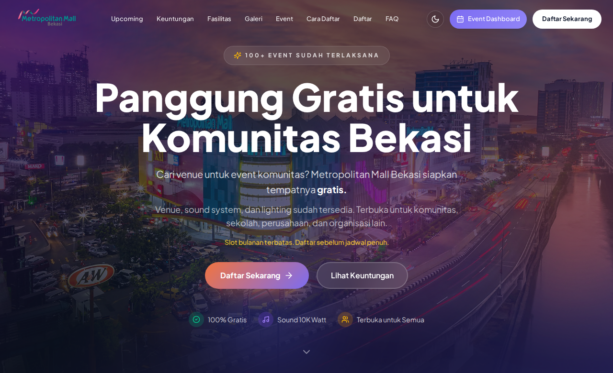
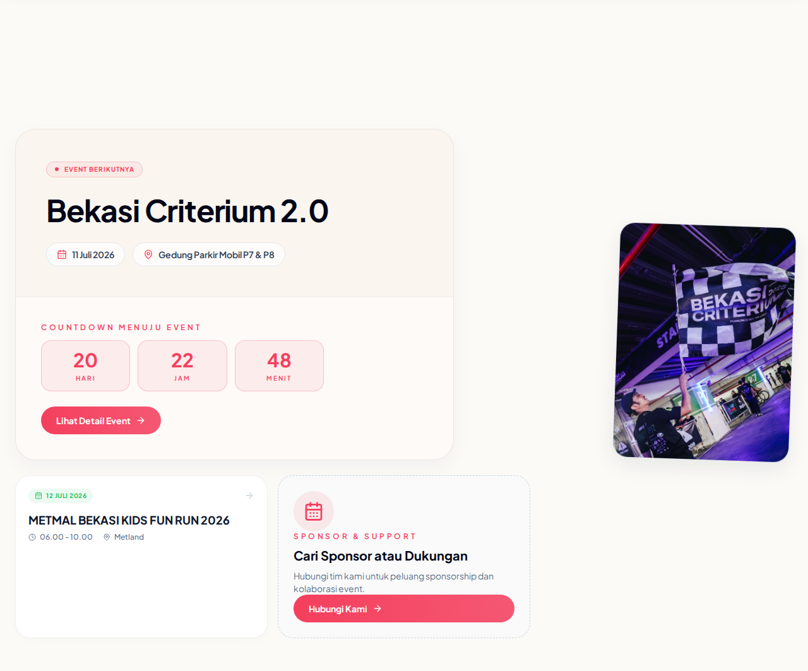
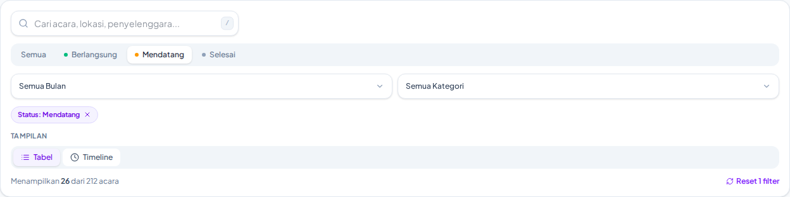
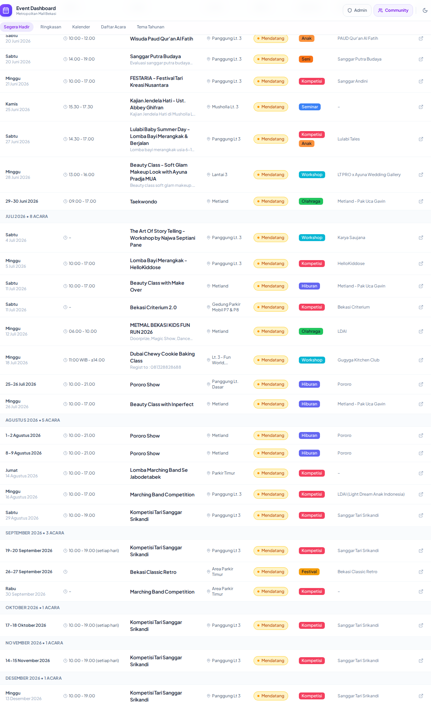
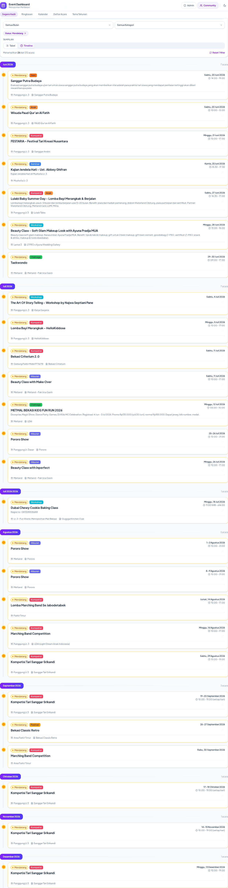

# Dashboard Calendar Event

Aplikasi dashboard untuk mengelola dan memantau jadwal event di Metropolitan Mall Bekasi.

## Screenshots

### Community Hub (Landing)

#### Hero Section


#### Upcoming Events


### Dashboard

#### Search & Filter Bar


#### Tabel View (Content)


#### Timeline View (Content)


## Tech Stack

- **React 19** + TypeScript
- **Vite** - Build tool
- **Tailwind CSS v4** - Styling
- **Lucide React** - Icons
- **date-fns** - Date manipulation
- **Supabase** - Backend (database, auth, storage)
- **React Router v7** - Routing
- **@vercel/analytics** - Analytics

## Fitur

### View Modes
- **Tabel** - Daftar event
- **Kalender** - Monthly (admin)
- **Kanban** - Berlangsung / Mendatang / Selesai (+ kolom Internal opsional)
- **Timeline** - Garis waktu event

### Fitur Utama
- Filter status, kategori, prioritas, bulan + pencarian
- Dark mode (system detect)
- Auto-detect kategori dari nama event
- Statistik (total, berlangsung, mendatang, selesai)
- Tema tahunan (quarter timeline)
- **Community Hub** + **Jadwal publik** (`/events`) + unduh PDF jadwal
- **Gallery** album foto
- **Survey Kepuasan** (pengunjung/organizer) — terpisah dari **Evaluasi Tenant**
- **Superadmin** — user management, activity log

### Admin Mode
- Login email + password (Supabase Auth)
- **Event** (jadwal resmi) + **Draft** (antrian pra-jadwal) — dua entitas; publish Draft → spawn Event
- Status Event dihitung dari tanggal (bukan workflow manual)
- Surat: generator PDF → **GeneratedLetter** (Supabase); bukan Google Apps Script
- Pendaftaran komunitas: approve **tidak** auto-buat Draft (CTA manual “Buat Draft dari pendaftaran”)

## Cara Menjalankan

```bash
# Install dependencies
npm install

# Development
npm run dev

# Build untuk production
npm run build
```

## Testing

```bash
# Run tests in watch mode
npm run test

# Run tests with UI
npm run test:ui

# Generate coverage report
npm run test:coverage
```

## Domain docs (bahasa bersama)

- [CONTEXT.md](./CONTEXT.md) — glossary + bounded contexts
- [docs/SPEC.md](./docs/SPEC.md) — product behavior
- [docs/SPEC-hygiene.md](./docs/SPEC-hygiene.md) — repo hygiene + letter cutover
- [docs/tickets/](./docs/tickets/) — board T-* / H-*
- [docs/adr/](./docs/adr/) — keputusan keras (Draft/Event, status, registration, letter)

## Testing

Unit (vitest) cover domain guards: status derive, publish Draft, permission matrix, letter no-GAS, schedule PDF filter, dsb.

```bash
npx vitest run --dir src --maxWorkers=2
```

## Konfigurasi

Buat file `.env` dengan:

```env
VITE_SUPABASE_URL=YOUR_SUPABASE_URL
VITE_SUPABASE_ANON_KEY=YOUR_SUPABASE_ANON_KEY
VITE_R2_ACCESS_KEY_ID=YOUR_R2_ACCESS_KEY_ID
VITE_R2_SECRET_ACCESS_KEY=YOUR_R2_SECRET_ACCESS_KEY
VITE_R2_BUCKET_NAME=YOUR_R2_BUCKET_NAME
VITE_R2_ENDPOINT=YOUR_R2_ENDPOINT
```

## Struktur Folder

```
src/
├── components/     # React components
│   ├── admin/      # Superadmin components
│   ├── community/  # Community hub components
│   ├── dashboard/  # Dashboard components
│   └── survey/     # Survey components
├── hooks/          # Custom hooks (useEvents, useToast, dll)
├── utils/          # Utility functions
├── types.ts        # TypeScript types
├── App.tsx         # Main app component
└── main.tsx        # Entry point
```

## Demo

- [Live Demo](https://metmal-community-hub.vercel.app/)
- [Admin Dashboard](https://metmal-community-hub.vercel.app/dashboard)

## Lisensi

MIT